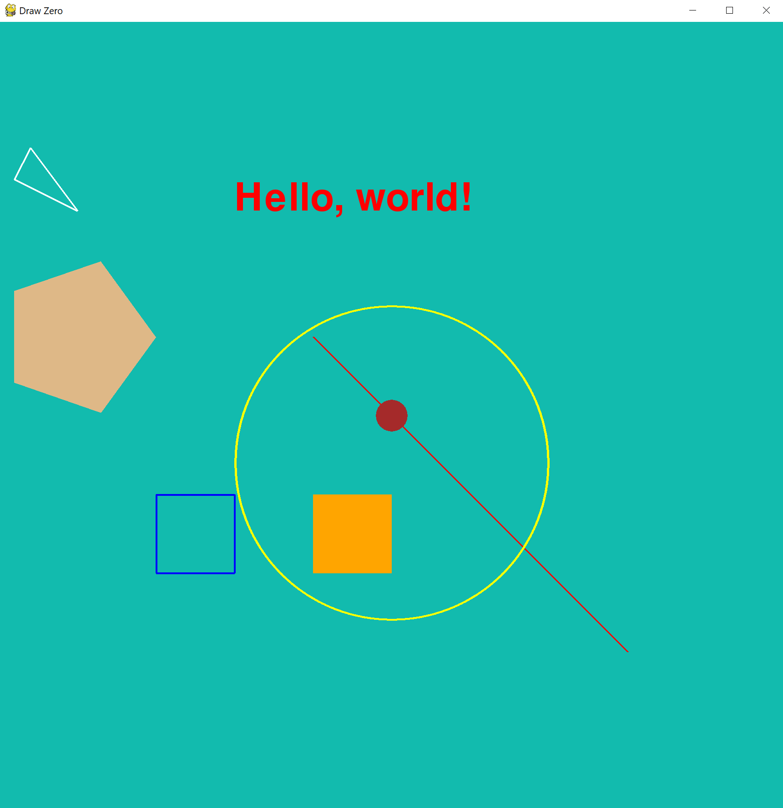
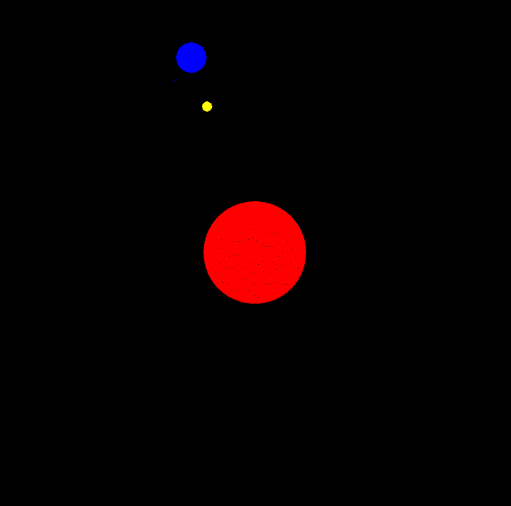
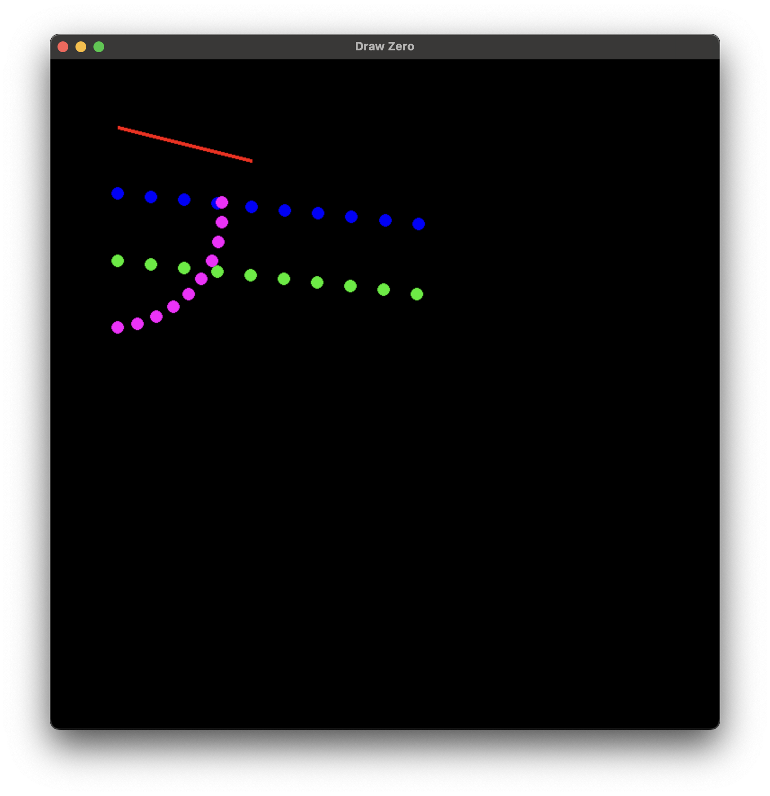
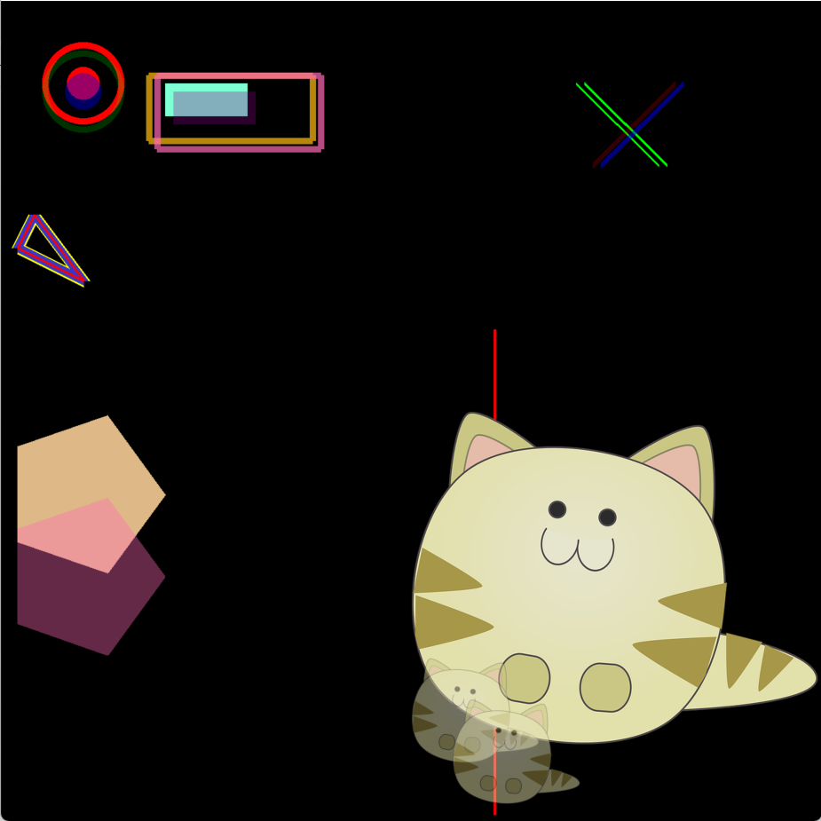
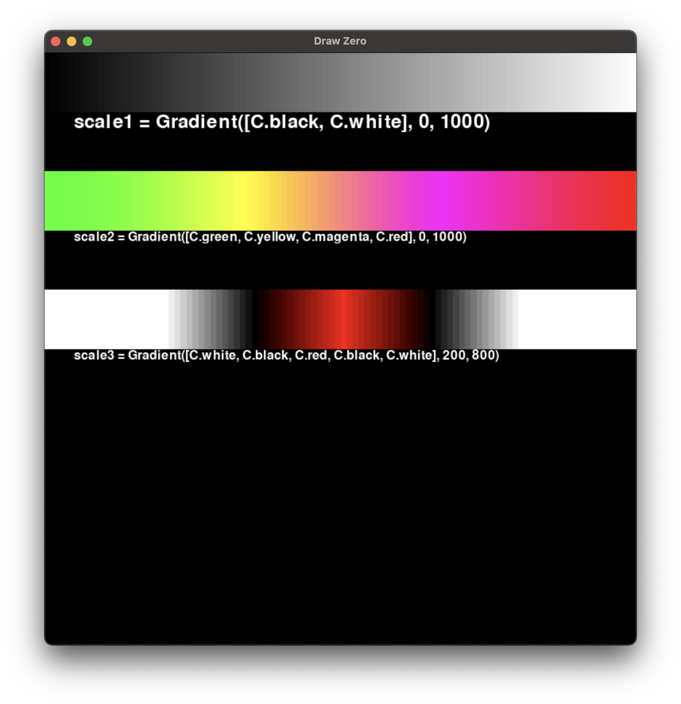
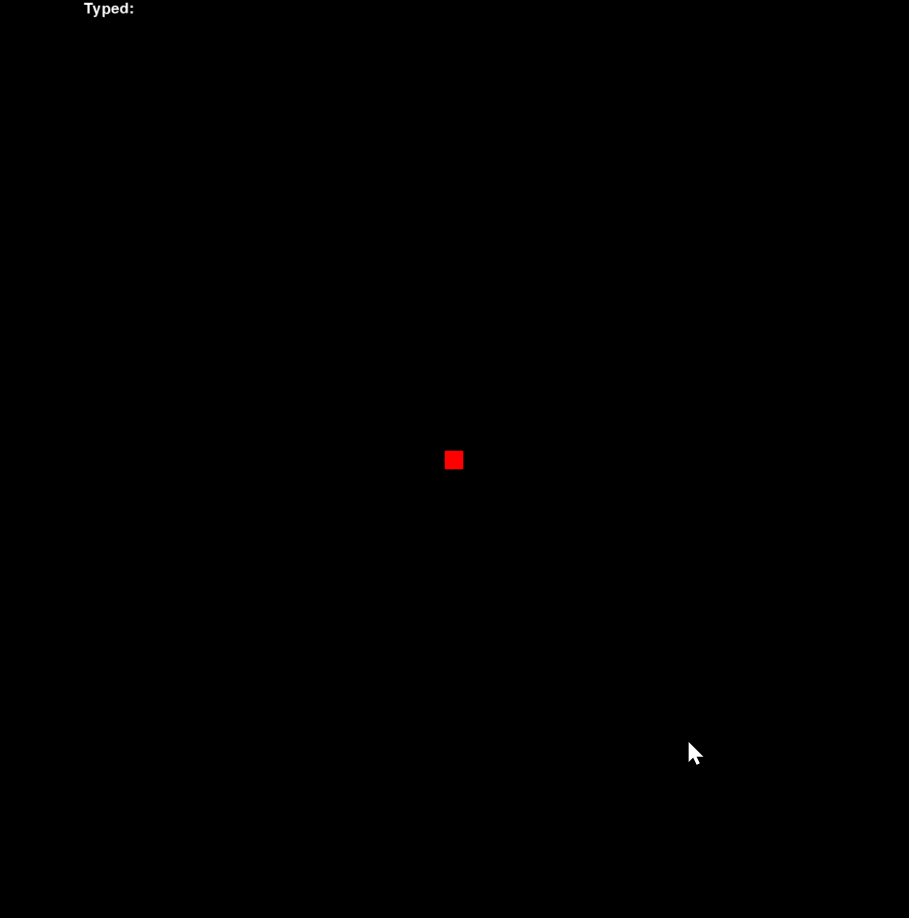

<p align="center">
<a href="https://pypi.org/project/drawzero/" target="_blank">

</a>


</p>

# Draw Zero
A zero-boilerplate canvas drawing framework for Python 3, based on Pygame.

**[Documentation](https://drawzero.org/)**


## Some examples

Here's some neat stuff you can do:

```python
# Just import everything
# Импортируем всё
from drawzero import *

# Red rectangle with upper left corner at (50, 150) and width = 900, height = 700
# Красный прямоугольник с левым верхнем углом в точке(50, 150), шириной 900 и высотой 700
rect('red', (50, 150), 900, 700)

# Straight orange line from (100, 500) to (900, 500)
# Оранжевая прямая линия из точки (100, 500) в точку (900, 500)
line('orange', (100, 500), (900, 500))

# Centered text
# Центрированный текст
text('green', 'Hello world!', (500, 250), fontsize=72)
text('blue', 'Привет, мир!', (500, 750), fontsize=72)
```



# Animation

Animations are also straightforward:



```python
from drawzero import *
from math import sin, cos, pi

earth_orbit = 400
earth_radius = 30
earth_rot_step = 2 * pi / 360
moon_orbit = 100
moon_radius = 10
moon_rot_step = 2 * pi / 60

for i in range(360 * 2):
    # First we make all calculations for the next frame
    e_x = 500 + earth_orbit * cos(earth_rot_step * i)
    e_y = 500 + earth_orbit * sin(earth_rot_step * i)
    m_x = e_x + moon_orbit * cos(moon_rot_step * i)
    m_y = e_y + moon_orbit * sin(moon_rot_step * i)

    # Sleep 1/30 second
    tick()
    # No we clear the canvas and draw the next frame
    clear()

    filled_circle(C.red, (500, 500), 100)
    filled_circle(C.blue, (e_x, e_y), earth_radius)
    filled_circle(C.yellow, (m_x, m_y), moon_radius)
```


# Point class which acts like 2-d vector and Turtle both



```python
from drawzero import *

# just coordinates
A = Pt(100, 100)
B = Pt(300, 150)
line(C.red, A, B)

# A point which acts as 2-d vector and as a Turtle
# Pt(x=0.0, y=0.0, *, heading=0.0)
#
# Provides (for a, b — points, k number):
#   * arithmetic
#     a+b — vector addition
#     a-b — vector subtraction
#     k*a and a*k — multiplication with scalar
#     abs  — absolute value of a
#     +a, -a

# arithmetic
A = Pt(100, 200)
dx = Pt(50, 5)
for i in range(10):
    filled_circle(C.blue, A + dx * i, radius=10)

#   * turtle-style movement
#     forward — Move the point forward by the specified distance.
#     backward — Move the point backward by distance.
#     right — Turn point right by angle degrees.
#     left — Turn point left by angle degrees.
#     goto — Move point to an absolute position.
#     rotate_around — Rotate around given point by angle degrees.
#     move_towards — Move towards the given point by the specified distance.
#     reset, home — Move point to the origin - coordinates (0,0), set heading=0
#     setx — Set the point's first coordinate to x
#     sety — Set the point's second coordinate to y
#     setheading — Set the point's heading

A = Pt(100, 300)
B = Pt(1000, 400)
for i in range(10):
    filled_circle(C.green2, A, radius=10)
    A.move_towards(50, B)

A = Pt(100, 400)
for i in range(10):
    filled_circle(C.magenta, A, radius=10)
    A.left(10).forward(30)

#   * information
#     position — Return the point's current location (x,y), as a tuple.
#     x, xcor — Return the point's x coordinate.
#     y, ycor — Return the point's y coordinate
#     heading — Return the point's heading
#     distance — Return the distance between points
#     towards — Return the angle towards point
#   * deep copy
#     copy — a clone of point
```


# Transparency

Transparency is also straightforward via alpha parameter or RGBA color:



```python
from drawzero import *

filled_circle('red', (100, 100), 20)
# Set line_width to change line_width
circle('red', (100, 100), 50, line_width=10)
# Set alpha from 0 to 255 to use transparency
filled_circle('blue', (100, 110), 22, alpha=100)
# Or user RGBA for color (RGBA stands for red green blue alpha)
circle((0, 255, 0, 50), (100, 110), 50, line_width=10)

filled_rect(C.aquamarine, (200, 100), 100, 40)
filled_rect(C.darkmagenta, (210, 110), 100, 40, alpha=80)
rect(C.darkgoldenrod, (180, 90), 200, 80, line_width=10)
rect(C.hotpink, (190, 90), 200, 90, alpha=180, line_width=10)

line('red', 600, 400, 600, 990)

polygon('yellow', [(20, 300), (100, 340), (40, 260)], line_width=20)
polygon((0, 0, 255, 200), [(20, 300), (100, 340), (40, 260)], line_width=15)
polygon('red', [(20, 300), (100, 340), (40, 260)])

filled_polygon('burlywood', 200, 600, 130, 504, 20, 542, 20, 658, 130, 696)
filled_polygon(C.hotpink, 200, 700, 130, 604, 20, 642, 20, 758, 130, 796, alpha=100)

line(C.green, (700, 100), (800, 200))
line(C.green, (710, 100), (810, 200), line_width=5)
line(C.red, (820, 100), (720, 200), line_width=10, alpha=50)
line(C.blue, (830, 100), (730, 200), line_width=10, alpha=128)

# Alpha channel is straightforward
rect('yellow', (500, 100), 100, 700, line_width=30, alpha=255)  # via alpha
rect('#00FFFF', (520, 120), 100, 700, line_width=30, alpha=100)  # via alpha
filled_rect((0, 255, 0, 50), (100, 500), 700, 100)  # via rgba

ellipse('grey', (100, 850), 200, 100, alpha=100)
filled_ellipse('red', (100 + 50, 850 + 25), 100, 50, alpha=100)
arc('blue', (200, 850), 200, 100, start_angle=45, stop_angle=270, alpha=100, line_width=10)

fill(C.magenta, alpha=30)
```


# Color gradients



```python
from drawzero import *


scale1 = Gradient([C.black, C.white], 0, 1000)
for x in range(0, 1000, 10):
    filled_rect(scale1(x), (x, 0), 10, 100)
text(C.white, 'scale1 = Gradient([C.black, C.white], 0, 1000)', (50, 100), 48, '<^')

scale2 = Gradient([C.green, C.yellow, C.magenta, C.red], 0, 1000)
for x in range(0, 1000, 10):
    filled_rect(scale2(x), (x, 200), 10, 100)
text(C.white, 'scale2 = Gradient([C.green, C.yellow, C.magenta, C.red], 0, 1000)', (50, 300), 32, '<^')

scale3 = Gradient([C.white, C.black, C.red, C.black, C.white], 200, 800)
for x in range(0, 1000, 10):
    filled_rect(scale3(x), (x, 400), 10, 100)
text(C.white, 'scale3 = Gradient([C.white, C.black, C.red, C.black, C.white], 200, 800)', (50, 500), 32, '<^')
```


# Keyboard and mouse events

Process keyboard events in two ways: check if key is pressed via `get_keys_pressed()` or run throw `keysdown` or `keysup` events:

```python
from drawzero import *

typed_letters = 'Typed: '
SIZE = 20
x = y = 500 - SIZE // 2

while True:
    # Mouse buttons events
    if mousebuttonsdown:
        x, y = mousebuttonsdown[0].pos
    # Keys which are still pressed
    keys = get_keys_pressed()
    dx = dy = 0
    if keys[K.LEFT] or keys[K.a]:
        dx = -5
    if keys[K.RIGHT] or keys[K.d]:
        dx = +5
    if keys[K.UP] or keys[K.w]:
        dy = -5
    if keys[K.DOWN] or keys[K.s]:
        dy = +5
    if keys[K.MOD_SHIFT] or keys[K.MOD_CTRL]:
        dx *= 4
        dy *= 4
    x += dx
    y += dy
    # Keyboard events
    for ev in keysdown:
        if ev.unicode:
            typed_letters += ev.unicode

    # Redraw everything
    clear()
    text(C.white, 'Press arrows to move square', (500, 70), 48)
    text(C.white, 'Press letters to type them', (500, 130), 48)
    text(C.white, 'Click mouse to move square', (500, 190), 48)
    text(C.green, typed_letters, (100, 250), 48, align='<.')
    filled_rect(C.red, x, y, SIZE, SIZE)
    filled_circle(C.yellow, mouse_pos(), 3)
    tick()
```




# Installation

In a Terminal window, type:
```shell
pip install drawzero --upgrade --user
```


Or run the following program:

```python
import os, sys
python = sys.executable
user = '--user' if 'venv' not in python and 'virtualenvs' not in python else ''
cmd = f'"{python}" -m pip install drawzero --upgrade {user}'
os.system(cmd)
from drawzero import *
```

# [Contributing](CONTRIBUTING.md) 
