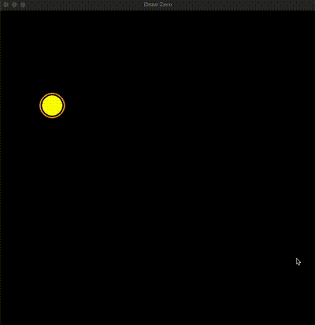

# Анимация

Анимация — обычный цикл: прочитайте снимок предыдущего `tick()`, измените переменные,
нарисуйте кадр, затем вызовите `tick()`, чтобы показать результат и подготовить следующий ввод.

```python
from drawzero import *

x = 50
while True:
    x += 5
    if x > 1100:
        x = 50
    clear()
    filled_circle(C.orange, (x, 300), 40)
    tick()
```



## Время

`tick(r=1, *, fps=30)` показывает рисунок один раз, затем ждёт и опрашивает события `r` раз.
По умолчанию частота ограничена 30 FPS; `tick(fps=60)` задаёт 60, а `tick(fps=0)` убирает
ограничение. Расчёты и рисование входят в интервал; ограничитель не ускоряет медленную
работу. Отрицательные и неконечные частоты запрещены. Возвращается `None`.

`tick(60)` по-прежнему выполняет 60 опросов, а не задаёт 60 FPS и не обновляет ваши
переменные 60 раз. Один публичный вызов публикует один накопленный кадр ввода.
`sleep(t=1)` выполняет `int(t * 30 + 0.5)` опросов с ограничением 30 FPS, сохраняя
отзывчивость окна и весь полученный ввод. `tick(0)` и `sleep(0)` показывают рисунок
и очищают временные данные без опроса.

## Очистка и следы

`clear()` очищает холст чёрным. `fill(color, alpha=255)` заливает цветом;
меньшая прозрачность alpha постепенно гасит прежний рисунок, не стирая его сразу.

```python
from drawzero import *

x = 0
while True:
    x = (x + 5) % 1000
    fill(C.black, alpha=30)
    filled_circle(C.cyan, (x, 500), 20)
    tick(fps=60)
```

`fps(fontsize=24)` рисует индикатор частоты кадров, но не задаёт её.
`quit()` закрывает окно; последующее рисование не откроет его заново. Статический
рисунок остаётся открытым до закрытия окна. Регулярно вызывайте `tick()`, чтобы
обрабатывать конечную очередь бэкенда. В разделе [клавиатура и мышь](keyboard_and_mouse_input.md)
описаны снимки, события, отмена при потере фокуса и полные интерактивные примеры.
