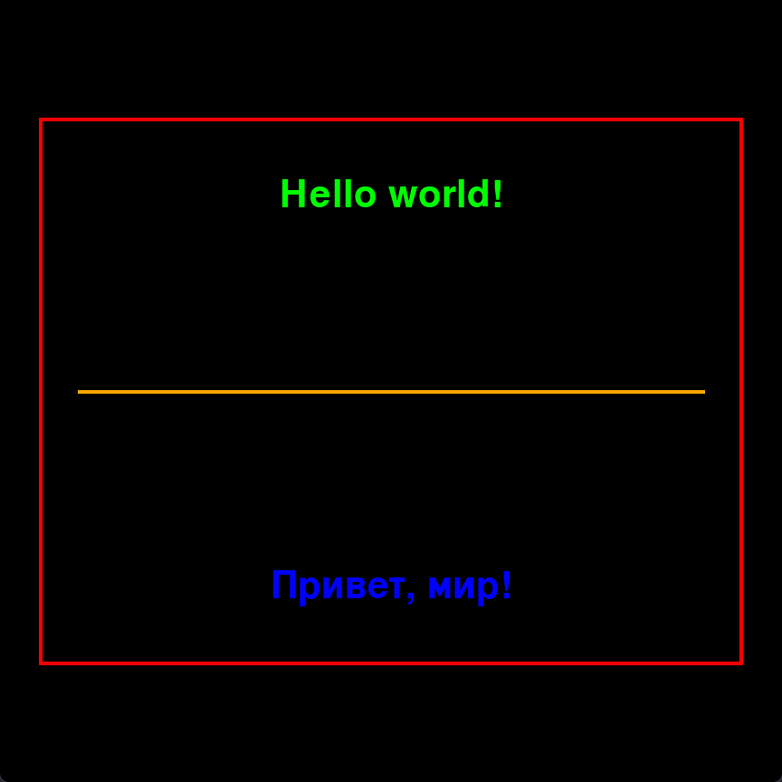
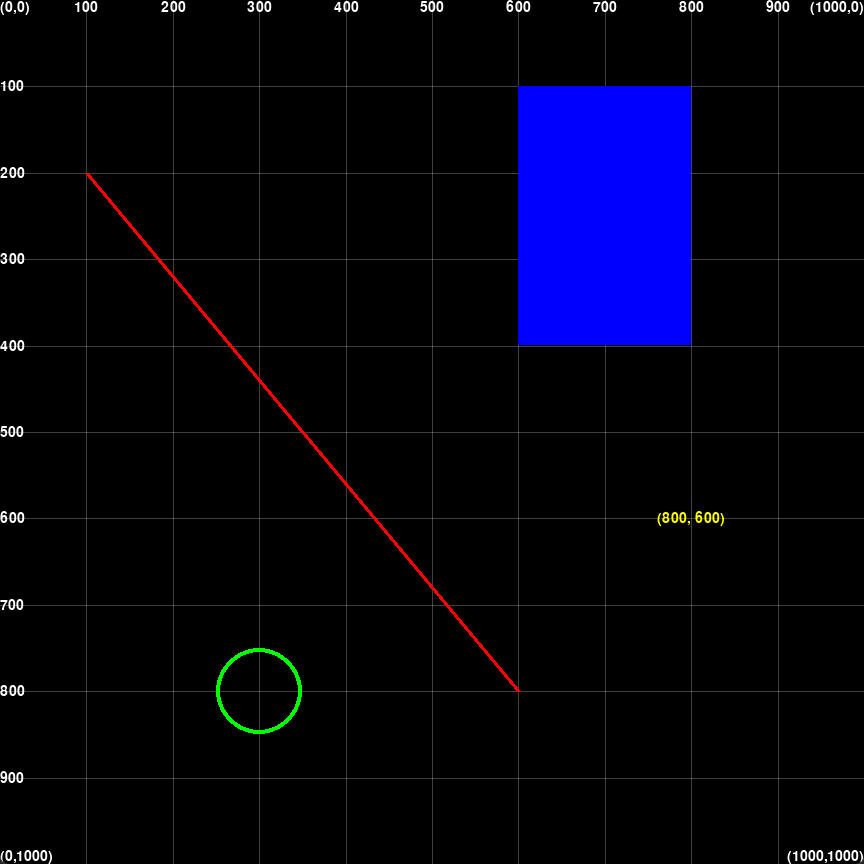

# DrawZero examples



``` title="00_hello_world.py"
--8<-- "src/drawzero/examples/00_hello_world.py"
```



``` title="01_grid_and_coordinates.py"
--8<-- "src/drawzero/examples/01_grid_and_coordinates.py"
```
