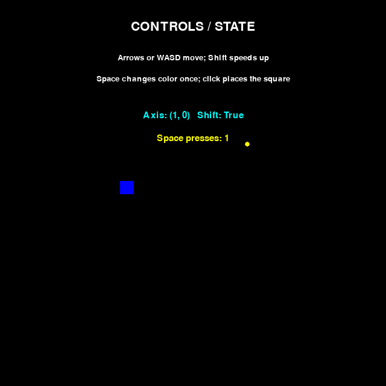
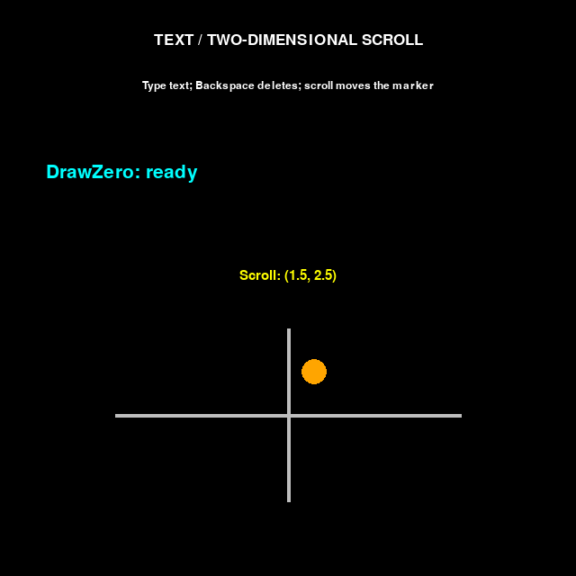
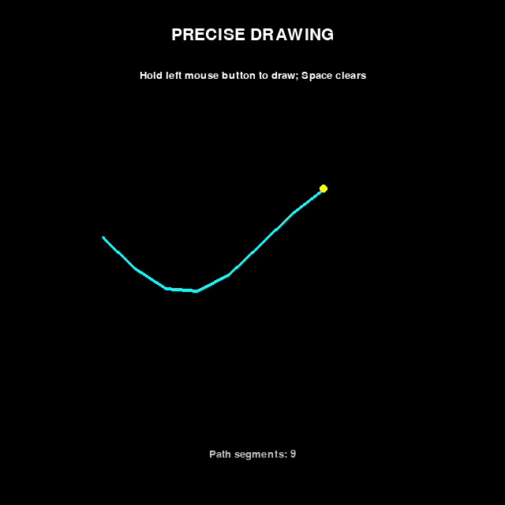

# Keyboard and mouse input

Use `keyboard` and `mouse` inside an ordinary loop. Read input, update your variables,
draw, then call `tick()`. The first iteration sees neutral input. Each `tick()` prepares
one snapshot for the next iteration; reading it never consumes or changes it.

## Continuous movement

This complete program moves a circle. An axis returns positive-held minus negative-held:
`-1`, `0`, or `1`. Both directions held, or neither held, give zero.

```python
from drawzero import *

x = y = 500
while True:
    x += 4 * keyboard.axis('left', 'right')
    y += 4 * keyboard.axis('up', 'down')
    clear()
    filled_circle(C.red, (x, y), 20)
    tick()
```

## One action on press; alternative controls and modifiers

`just_pressed` is true for one input frame, including a press released before that frame
ends. Holding a key or receiving automatic repeats does not create another press.
`just_released` reports an up transition. Several readers can see the same transition.

Multiple arguments mean **any**: `keyboard.pressed('left', 'a')` accepts either control.
For a chord use `keyboard.pressed('ctrl') and keyboard.just_pressed('s')`.
Releasing Left while still holding A makes `just_released('left', 'a')` true.

Each side of `axis` accepts a single key or a nonempty flat tuple/list of alternatives.
`keyboard.axis(('left', 'a'), ('right', 'd'))` still returns an integer, with no smoothing,
time scaling, or preference for the last key. Duplicates have no additional effect.

`shift`, `ctrl`, `alt`, and `meta` are virtual keys combining left and right modifiers.
`cmd` means `meta`. A group presses when its first side presses and releases when its
last side releases. Pressing right Shift while left Shift is held is not a new group
press; releasing left Shift while right Shift remains held is not a group release.
A group released and pressed again within one frame has both edge flags.
Individual names such as `lshift`, `rshift`, `lctrl`, and `rmeta` remain available.

Here is a complete controls demonstration, including click placement at the original
click position:

```python
--8<-- "src/drawzero/examples/16_keyboard_and_mouse.py"
```



Rendered example output from deterministic replay; not a hardware-input test.

## Mouse position and buttons

`mouse.pos` is an immutable `(x, y)` in virtual canvas coordinates, including fractions
and positions outside the canvas. Construct `Pt(*mouse.pos)` when you need a mutable
point. Query `mouse.pressed('left')`, `mouse.just_pressed('right')`, or
`mouse.just_released(M.MIDDLE)`. Names are case-insensitive; constants and numbers
are equivalent: `M.LEFT == 1`, `M.MIDDLE == 2`, `M.RIGHT == 3`.
Only these three buttons are supported in the new API.

`mouse.rel` is the sum of delivered movement deltas, scaled into virtual coordinates.
It is not the difference between two positions. Reading it repeatedly does not reset
it. Positions use the transform at event delivery; saved events never change when
the canvas is resized or its virtual size changes. Motion before and after a resize
can therefore use different scales. Invalid native dimensions use a neutral scale.

## Scroll and text aggregates

`mouse.wheel` gives `(horizontal, vertical)` in scroll units, not pixels. Positive is
right and up (away from the user); a backend flipped-direction flag is corrected once.
Fractional precise values, including zero, are preserved where supplied; older backends
fall back to whole scroll units. Scroll is never scaled with the canvas.

`keyboard.typed` concatenates confirmed text in arrival order. It supports Unicode,
including Cyrillic and Greek. Composition is available through `E.TEXT_EDITING`;
it does not enter `typed` until confirmed. Key-down `unicode` does not also enter
`typed`, so text is not inserted twice.

## Ordered events

Use `events()` when order matters. It returns the same immutable tuple on every read
within a frame. `keyboard.events` contains keys and text; `mouse.events` contains buttons,
motion, and wheel. These cached tuples share their event objects with the common stream.
Focus and resize events appear only in the common stream. Saved tuples remain valid
across later frames. The stream covers the supported event families below, not every
SDL event. Window close keeps the usual program-exit behavior.

`typed` is a convenience, not a text editor. Text → Backspace → text must be processed
in event order. This complete program also demonstrates two-dimensional scrolling:

```python
--8<-- "src/drawzero/examples/22_text_and_scroll.py"
```



Rendered example output from replayed text and wheel events; no hardware IME is exercised.
The sample deletes one Python character, not a complete Unicode grapheme cluster.

## Precise drawing and dragging

`event.pos`, `event.rel`, and `event.buttons` describe the event when it occurred.
`mouse.pos` and `mouse.pressed()` describe the final state. Test membership with
`M.LEFT in event.buttons`. Multiplying final button state by whole-frame `mouse.rel`
is not precise dragging: some motion may precede the press or follow its release.
Use ordered events and terminate an interaction on focus loss:

```python
--8<-- "src/drawzero/examples/21_precise_drawing.py"
```



Rendered example output from a fixed pointer trace. Every delivered motion is retained;
there is no motion coalescing mode.

## API reference

| API | Result |
| --- | --- |
| `keyboard.pressed(key, *other_keys)` | Any specified key held: `bool` |
| `keyboard.just_pressed(key, *other_keys)` | Any genuine down transition: `bool` |
| `keyboard.just_released(key, *other_keys)` | Any up transition: `bool` |
| `keyboard.axis(negative, positive)` | Integer `-1`, `0`, or `1` |
| `keyboard.typed` | Confirmed text, or `''` |
| `keyboard.events` | Tuple of key/text events |
| `mouse.pressed(button, *other_buttons)` | Any specified button held: `bool` |
| `mouse.just_pressed(button, *other_buttons)` | Any down transition: `bool` |
| `mouse.just_released(button, *other_buttons)` | Any up transition: `bool` |
| `mouse.pos`, `mouse.rel` | Immutable virtual-coordinate pairs |
| `mouse.wheel` | Immutable horizontal/vertical scroll pair |
| `mouse.events` | Tuple of mouse events |
| `events()` | Tuple of all supported events in delivered order |
| `K`, `KEY` | Same key-code namespace: `K.LEFT`, `K.a`, `K.A`, `K.SPACE` |
| `M` | `LEFT`, `MIDDLE`, `RIGHT` |
| `MOD` | Typed bit flags: `SHIFT`, `CTRL`, `ALT`, `META`/`GUI`, individual `L`/`R` sides, `NUM`, `CAPS`, `MODE`, `NONE` |
| `E` | Event-type constants listed below |
| `tick(r=1, *, fps=30)` | Present drawing, wait/poll `r` times, publish once; returns `None` |

Keys accept existing numeric codes or case-insensitive names from `K`: `left`, `a`,
`space`, etc. `enter`/`return` and `esc`/`escape` are deliberate aliases. `A` and `a`
mean the same logical key, with no implied Shift. These are logical keys, not physical
scancodes or arbitrary Unicode text. Layouts can map physical keys differently;
scancodes are retained in events for inspection, not accepted as physical bindings.

State queries require at least one argument and validate every argument, even after a
match. Unknown names/codes, booleans, nested or empty axis groups, and unsupported
objects raise errors. `MOD` values are masks, not keys; use `event.mod & MOD.CTRL`.
Diagnostics follow `set_lang('en')` or `set_lang('ru')` and suggest close spellings.

### Event payload reference

Read-only, slotted tuple values have named, typed fields and useful representations.
Classes are available from `drawzero.utils.input`. All have `type` and `source`.

| `event.type` | Class and payload |
| --- | --- |
| `E.KEY_DOWN`, `E.KEY_UP` | `KeyEvent`: `key`, `mod`, `scancode`, `unicode`, `repeat` (false on up) |
| `E.TEXT_INPUT` | `TextEvent`: `text` |
| `E.TEXT_EDITING` | `EditingEvent`: `text`, `start`, `length` |
| `E.MOUSE_DOWN`, `E.MOUSE_UP` | `ButtonEvent`: `button`, `pos`, `mod` |
| `E.MOUSE_MOVE` | `MotionEvent`: `pos`, `rel`, `buttons` (frozenset of identifiers), `mod` |
| `E.MOUSE_WHEEL` | `WheelEvent`: floating-point `x`, `y`, historical `pos` or `None` |
| `E.FOCUS_LOST`, `E.FOCUS_GAINED` | `FocusEvent`: no additional payload |
| `E.WINDOW_RESIZED` | `ResizeEvent`: native window `(width, height)` in `size` |

Unknown key fields default to `key=0`, `mod=MOD.NONE`, `scancode=None`, `unicode=''`.
Repeat uses a supplied backend flag or tracked physical/logical identity. Event masks
use supplied values or modifier history, not the final keyboard state.
`source` is immutable `Provenance(window, which, touch, cancelled)`: identifiers/touch
origin are `None` when unavailable; `cancelled` defaults to false. A supplied cancellation
clears the affected state without inventing an ordinary release edge. Pygame does not
reliably label all synthetic releases; DrawZero does not guess. No hardware timestamp
or precision beyond delivered queue order is promised.

## Frame, focus, and timing details

A press followed by release in one frame gives held=false, just-pressed=true,
just-released=true. Multiple presses retain all events but still have boolean edge flags.
A quiet frame clears events, edges, text, motion, and scroll while retaining held state.
Getters do not read the OS, pump events, wait, or create a window.

`tick(fps=60)` and `tick(fps=120)` change the rate limit; `tick(fps=0)` disables waiting.
Negative or non-finite rates are invalid. `tick(60)` still means 60 internal polls.
`sleep(t)` waits/polls `int(t * 30 + 0.5)` times at 30 FPS and publishes their accumulated
history once. `tick(0)` and `sleep(0)` present and clear transients without polling.
Long sleeps retain O(number of delivered events) history. SDL's upstream queue is finite:
blocking your program arbitrarily can lose input before DrawZero receives it.

Focus loss clears held keys/buttons and accumulated motion, without fake release edges.
Keep genuine earlier transitions; cancel drags and composition when `E.FOCUS_LOST` arrives.
Mouse leaving the window alone is not keyboard focus loss. After a focus-gain batch,
DrawZero reconciles final held state with pygame's authoritative state, without fresh
presses or erasing genuine transition history. This snapshot has only logical keys;
physical associations rebuild on subsequent delivered presses.

EJUDGE mode has neutral input and imports no GUI backend solely for input. `quit()`
closes the window permanently for that process; further drawing does not recreate it.
Static drawings still stay open until the user closes the window.
